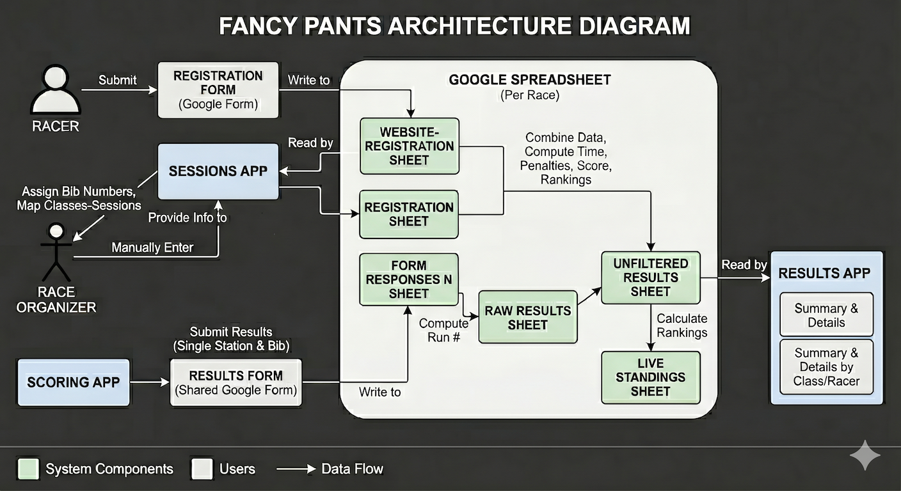

This repo contains web apps for the Fancy Pants used by the
[New England Slalom Series](https://www.nessrace.com/). There are
currently three apps:

* Scoring, for recording gate judging results and raw time for each bib number.
* Results, for viewing race results in real time.
* Sessions (in development!), for assigning classes to sessions with
  the fewest racers in both sessions.

# Architecture

[](architecture_diagram.png)


Fancy Pants consists of these components:

* The Registration form, a per-race Google Form submitted by racers
  for collecting racer name, contact information, classes to enter,
  and tandem boat partner names.
* The Results form, a single Google Form form shared by all races
  submitted by teh Scoring app for collecting race results including
  bib number, gates touched or missed, and run time.
* A Google Spreadsheet for each race. The spreadsheet contains
  multiple sheets:
  * Website-Registration: Submissions from the Registration form.
  * Registartion: Summary of racer name, class, tandem partner, bib
    number, and work assignment, manually entered by the race
    organizer based on Website-Registration and the Sessions app.
  * Form Responses N: Submissions from the Results form.  Each Results
    submission contains only a subset of the gate results or the raw
    run time for a single run of a single bib number.
  * Raw Results: Intermediate computation on Form Responses to
    determine the Run # for each results submission.
  * Unfiltered Results: Computations combining the Registration sheet
    and Raw Results to determine name, class, raw time, combined penalties
    across all stations, and total score for each run for each bib,
    along with class rankings.
  * Live Standings: A calculated table showing place rankings (1st
    through Nth) for each class.
* The Sessions app reads racer, tandem partner, and class information
  from the Website Registration sheet to determine class to session
  mappings and assign bib numbers to racers. The race organizer then
  manually constructs the Registration sheet based on this
  information.
* The Scoring app submits results to the Results Responses sheet for a
  single station and bib at a time.
* The Results app reads the Unfiltered Results sheet and displays
  summary and detail information by class and racer.

# Deployment

These apps need to work on race weekends or else the race cannot
run. For increased reliability, this repo is stored on both
[GitHub](https://github.com/newenglandslalomseries/fancy-pants-ui) and
[GitLab](https://gitlab.com/aca-ne-group/fancy-pants-ui). GitHub is
the primary location; all development occurs there. GitLab is
configured to mirror the repo so all changes on GitHub appear there as
well.

The web apps are deployed on GitHub Pages and GitLab Pages. The URLs
are

* Scoring
  * GitHub: https://newenglandslalomseries.github.io/fancy-pants-ui/scoring.html
  * GitLab: https://fancy-pants-ui-e906da.gitlab.io/scoring.html
* Results
  * GitHub: https://newenglandslalomseries.github.io/fancy-pants-ui/results.html
  * GitLab: https://fancy-pants-ui-e906da.gitlab.io/results.html
* Sessions
  * GitHub: https://newenglandslalomseries.github.io/fancy-pants-ui/sessions.html
  * GitLab: https://fancy-pants-ui-e906da.gitlab.io/sessions.html

# Race preparation

The steps required to prepare for an upcoming race are:

* In advance, prepare the race results spreadsheet.
  * Update the Fancy Pants Results UI Google Form to link to the
    spreadsheet.
  * Update the formulas on the Raw Results sheet of the spreadsheet to read from
    the new sheet created when the form was linked to the spreadsheet.
* Update the races.json to include the race results spreadsheet,
  making sure the upcoming race is listed first in the file.
* Once the course is set up, edit the current_race.json file to
  reflect the race name and gate to station assignments.

Details for each of these steps are below.

# Scoring app

## Editing the race configuration

The `current_race.json` file configures the app:

```
{
  "race_name": "Sample Slalom",
  "stations": [
    { "name": "Start", "max_gate": 2 },
    { "name": "Station A", "max_gate": 6 },
    { "name": "Station B", "max_gate": 12 },
    { "name": "Station C", "max_gate": 18 },
    { "name": "Station D", "max_gate": 25 },
    { "name": "Finish", "is_finish": true }
  ]
}
```

* The race_name is displayed at the top of the scoring app.
* Add or remove stations as necessary. Set max_gate to the highest
  number for that station. In this example, `Start` is judging gates 1
  and 2, `Station A` is judging gates 3, 4, 5, and 6, etc.
* The station with `"is_finish": true` will have the field to enter
  raw run time. The station with is_finish set to true cannot also
  judge gates, but you can always add an additional station if needed.
* IMPORTANT: Do not add extra commas after `max_gate` or the last station entry.

After editing the file, wait a few minutes for the changes to deploy
then refresh the scoring app in your browser to see the changes.

## The Google Form and spreadsheet

The scoring app submits results to a Google Form; it gets the URL for
the form from the 'u' query parameter. The app contains specific field
IDs from this form so it can only work with this specific
form. However, the form can be changed to write its results to any
spreadsheet.

To change the spreadsheet that the form writes to:

* Edit the form by clicking the pencil icon in the lower right corner.
* Click on the Responses tab.
* Click the three-dots icon on the top right side of the form and
  choose "Delete All Responses" unless you want the current responses
  to be written to the new spreadsheet you are about to select.
* Click the three-dots icon again and choose "Unlink form" to disconenct from the current spreadsheet.
* Click "Link to sheets" at the top of the form.
* Choose "Select existing spreadsheet" then select the race spreadsheet you want or paste in its URL.
* A new sheet named something like "Form Responses N" will be created in the spreadsheet you choose.

Now that you've created a new scoring form results sheet in the race
spreadsheet, you need to udpate the Raw Results sheet to read from it:

* Vist the Raw Reslts sheet and click on Cell A1.
* The cell will contain a formula like `=ARRAYFORMULA('Form Responses 5'!A1:A1001)`.
* Selecth Edit menu > Find and replace.
* Enter the old form response sheet name, like "Form Responses 5", into the Find box.
* Enter the new form response sheet name, likee "Form Responses 6", into the Replace with box.
* In the Search drop down, choose "All sheets" (though only the Raw Results sheet should actually reference it).
* Check the "Also search within formulas" checkbox.
* Click "Replace all".
* Click "Done".

## Changing the submission form

If we need to add new fields to or replace the scoring submission
form, we have to update the "entry IDs" in the HTML and Javascript
code in the app. To get the entry IDs for a form:

* Edit the form.
* Click the three-dots icon at the top right of the page (not the
  top-right of the form) and select "Pre-fill form".
* A new browser tab will open to display the form. Enter a value for
  every question that you need the entry ID for.
* At the bottom of the form, click "Get link".
* Click the "Copy link" button that appears. This copies a pre-filled
  form URL to the copy-and-paste buffer.

The pre-filled form contains GET query parameters for each form
question that had a value. For example, when I only clicked on the
"Clean" button for gate 25, the pre-filled form link was
`https://docs.google.com/forms/d/e/.../viewform?usp=pp_url&entry.1989426203=Touch`
so `entry.1989426203` is the entry ID for the Gate #25 question.

# Results app

## Adding races to the viewer

The `races.json` file lists all the races the viewer app can show results for:

```
{
  "races": [
    {
      "name": "Farmington Slalom 2025",
      "url": "https://docs.google.com/spreadsheets/d/.../edit?gid=1657054501#gid=1657054501"
    }
  ]
}
```

To add a new race spreadsheet, add a new curly-bracket (`{}`) object
with keys `name` and `url` to the square-bracket (`[]`) array:

```
{
  "races": [
    {
      "name": "Kenduskeg Slalom 2026",
      "url": "https://docs.google.com/spreadsheets/d/...?gid=1657054501#gid=1657054501"
    },
    {
      "name": "Farmington Slalom 2025",
      "url": "https://docs.google.com/spreadsheets/d/...?gid=1657054501#gid=1657054501"
    }
  ]
}
```

The URL must be for the "Unfiltered Results" sheet in the
spreadsheet. It is identified by the `gid` key in the URL.

Add a comma between the name and url values and between entries in the
array, but not after the url value or after the final entry in the
array.

The results viewer can display results for any file in the races.json
file. It selects the first race in the file when initially loaded.

# Sessions app

TODO.
